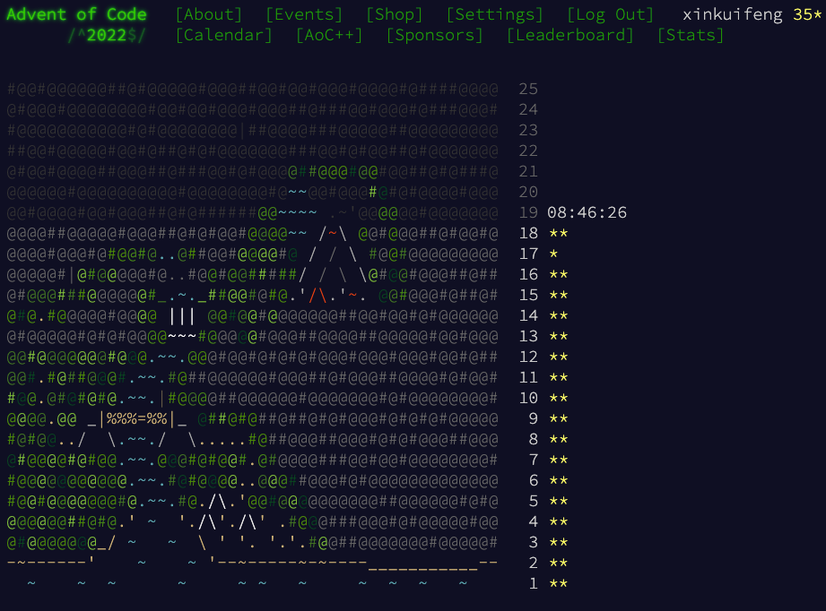

# Advent Of Code 2022

Link: https://adventofcode.com/2022

This folder contains my implementations written in C++. The source code can be compiled by
the following command:

```sh
g++ -std=c++17 part1.cc
```

You can use the following command to run the binary.

```sh
./a.out sample
```

As per [this thread](https://www.reddit.com/r/adventofcode/comments/zh2hk0/2022friendly_reminder_dont_commit_your_input/)
on Reddit, the real input file is not shared publicly.



