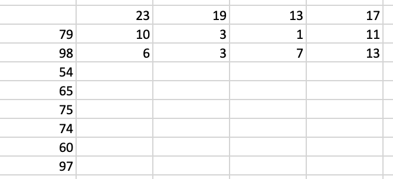

# Reflect

I was stuck for a long while on part2. And finally got some inspiration
from this excel sheet:



**Use modulo to control the worry level**.

Each item is unique and can be identified by its id. Instead of having only one value,
the item has a list of values. The size of the list equals to the number of monkeys.
The numerical operation (add / multiply / square) is applied to this list of values.
Then each value is reduced to:

```cpp
// part2
val %= monkey[idx].div;
// recall that in part1, we have:
// val /= 3;
```

The reduced value is then tested and passed to the next monkey.

